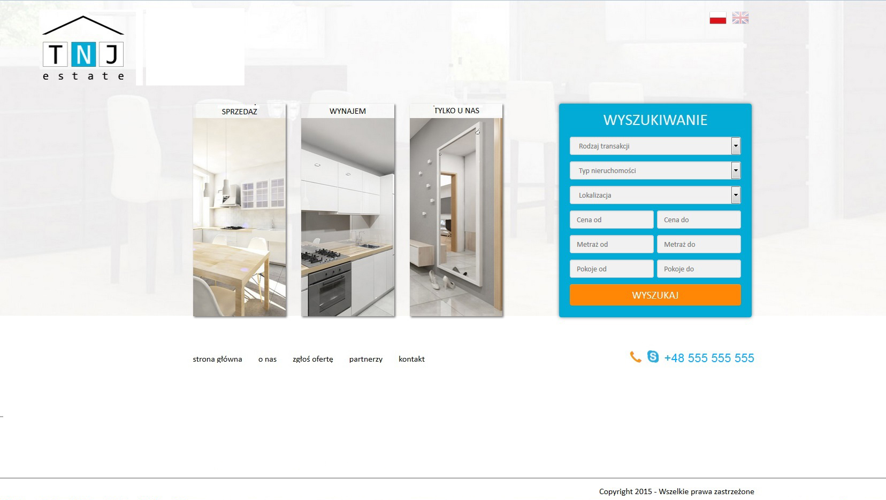

# TNJ Estate
Aplikacja dla biura nieruchomości. Niestety nie jest już dostępna pod adresem online.
W pełni responsywna, działa na każdym urządzeniu.

Jest to aplikacja z 2015 roku, jedna z pierwszych poważniejszych projektów. Co prawda jest to projekt PHP, ale przedstawia ogólną wiedzę z tworzenia Web Aplikacji.

# Technologie
- PHP
- MySql + PDO
- Wzorzec MVC
- jQuery
- Bootstrap 3
- LESS

# Galeria

